<div align="center">

# The Brain

**A 3D brain that sees, learns, defends, and dreams — 35 cognitive layers, zero backprop, browser-native.**

[](#license)
[](https://react.dev)
[](https://vitejs.dev)
[](https://r3f.docs.pmnd.rs/)
[](#run-it-locally)

<br/>

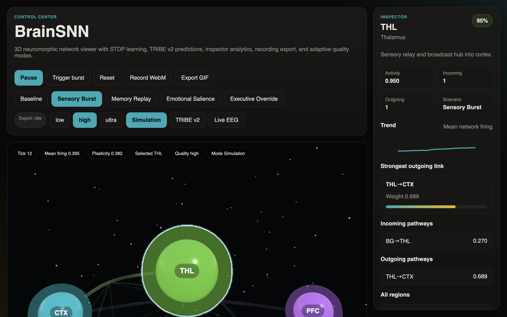

<br/>

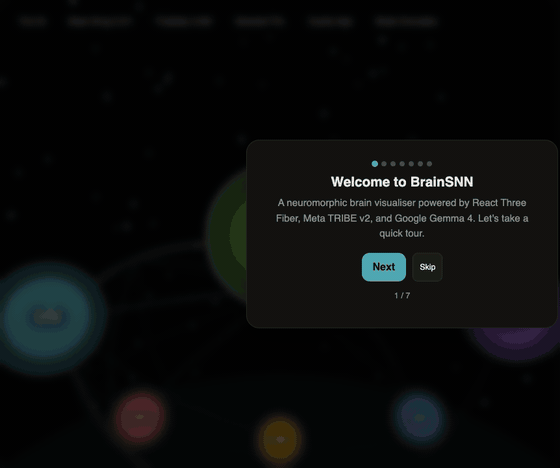

</div>

---

## What this is

**BrainSNN** is a 3D neuromorphic brain viewer that runs entirely in your browser. Seven anatomical regions, ten plastic pathways, and 35 layered cognitive features stacked on top — a Cognitive Firewall, a self-evolving rule engine, multimodal RAG, an affective decoder, a neurochemistry sandbox, an idle Dream Mode, an MCP bridge to your AI agents, and more.

Drop a paragraph in. Watch the amygdala glow. Slide cortisol up. Watch the hippocampus drop. Open Brain Evolve. Watch the firewall grow new rules to catch the manipulation it just missed. Open Dream Mode. Walk away. Come back to a brain that's been consolidating its weights while idle.

No backprop. No retraining. No server required for the main demo — TRIBE v2, Gemma 4, and the WebSocket sync are _optional_ upgrades, each behind one env var.

## Run it

- **Frontend:** runs entirely in your browser. `npm install && npm run dev` — done. See [Run it locally](#run-it-locally) for the production preview path.
- **TRIBE v2 backend:** optional. Local: `cd brainsnn-r3f-app/server && uvicorn api:app --reload`. Cloud configs (Fly.io / Railway / Docker) are checked in for when you want to host it remotely — see [brainsnn-r3f-app/server/README.md](brainsnn-r3f-app/server/README.md).

## The 35 layers

The full feature catalog lives in [.ai-memory/MEMORY.md](.ai-memory/MEMORY.md). A curated tour:

| Hero shot                                                            | What it does                                                                                                                                                                                                                                            |
| -------------------------------------------------------------------- | ------------------------------------------------------------------------------------------------------------------------------------------------------------------------------------------------------------------------------------------------------- |
| 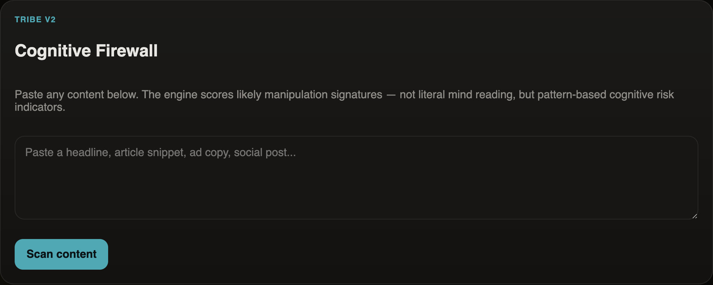  | **Layer 4 — Cognitive Firewall.** Regex-based scoring across urgency / outrage / fear / certainty. Returns a 4-dimension manipulation profile and the matched evidence.                                                                                 |
| 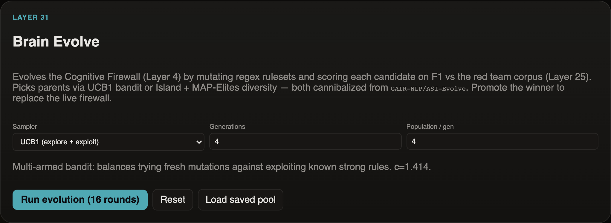        | **Layer 31 — Brain Evolve.** UCB1 / Island / MAP-Elites samplers (cannibalized from `GAIR-NLP/ASI-Evolve`) mutate firewall rulesets and score each candidate's F1 against the red-team corpus. Promote the winner to swap the live firewall.            |
| 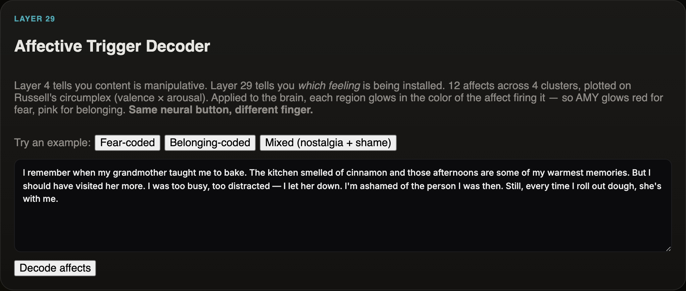   | **Layer 29 — Affective Decoder.** 12-affect taxonomy across threat / reward / social / cognitive clusters, plotted on Russell's valence × arousal circumplex. Tells you _which_ feeling is being installed, not just that something pressed the button. |
| 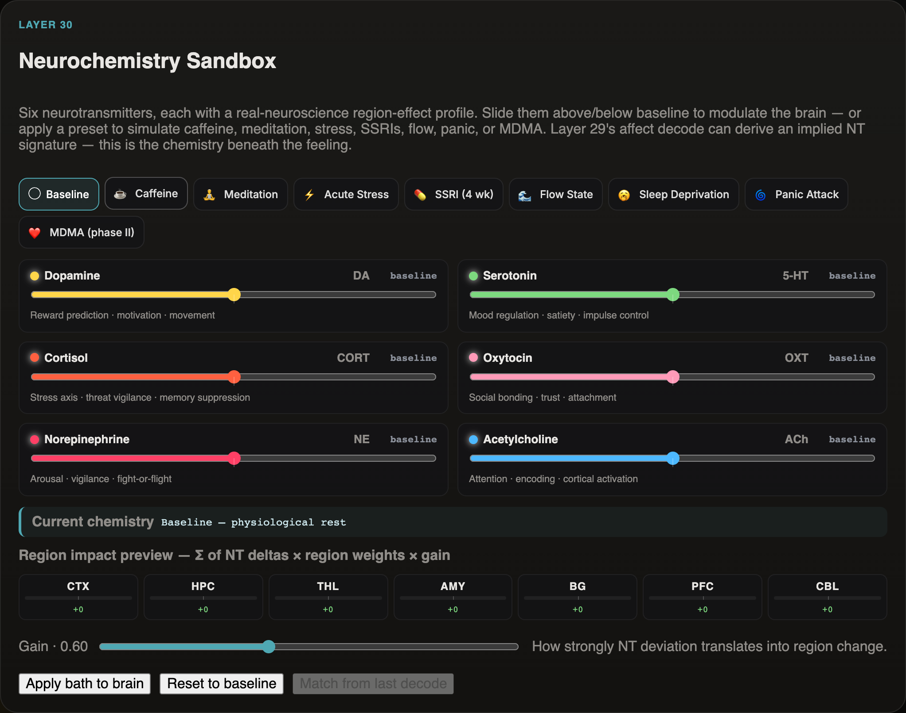      | **Layer 30 — Neurochemistry Sandbox.** 6 NT sliders with real region-effect profiles. 9 presets (caffeine, meditation, acute stress, SSRI 4 wk, MDMA phase II, …). Match an NT signature to the last decoded affect.                                    |
| 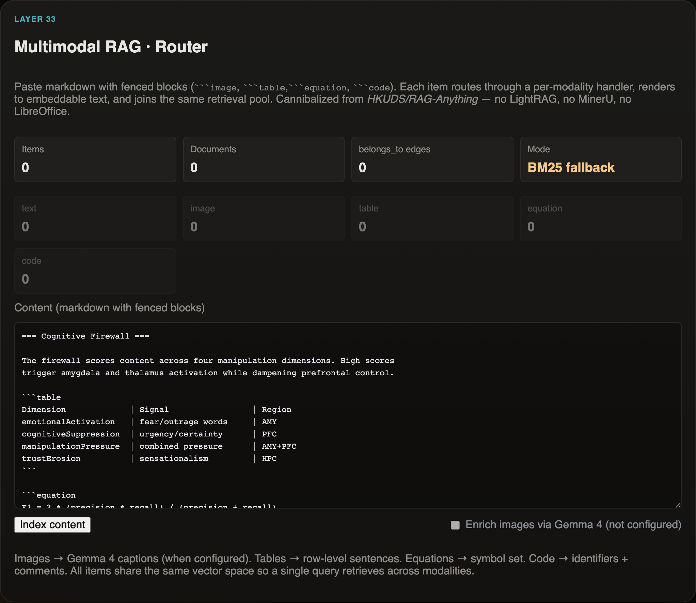      | **Layer 33 — Multimodal RAG Router.** Cannibalized from `HKUDS/RAG-Anything`. Routes text / image / table / equation / code through per-modality handlers, each rendered into embeddable text.                                                          |
| 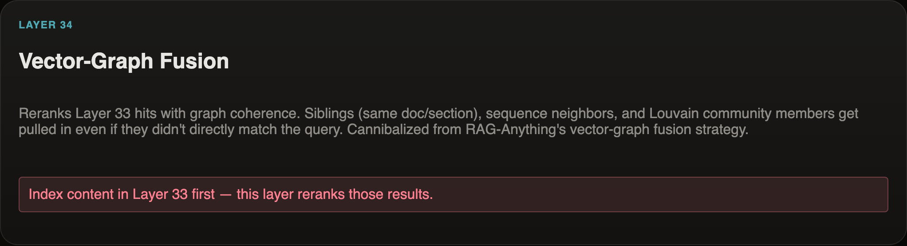 | **Layer 34 — Vector-Graph Fusion.** Reranks Layer 33 hits with graph coherence (Louvain communities + sequence neighbors + sibling pulls). Slider controls the vector ↔ graph weight.                                                                   |
| 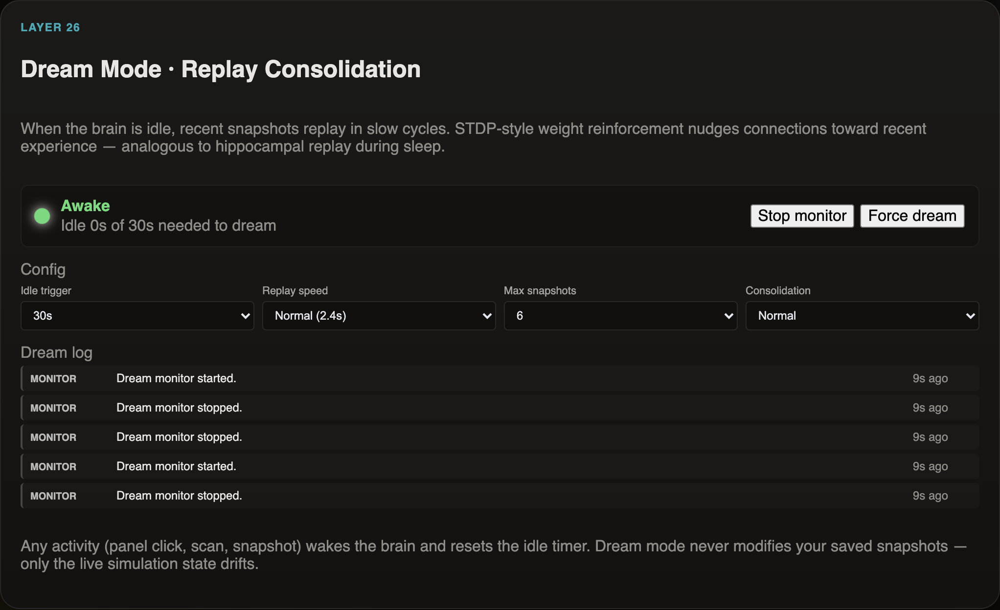          | **Layer 26 — Dream Mode.** Idle monitor drifts the brain into replay-consolidation after N seconds. Co-active region pairs gain weight (STDP). Any activity wakes the brain.                                                                            |
| 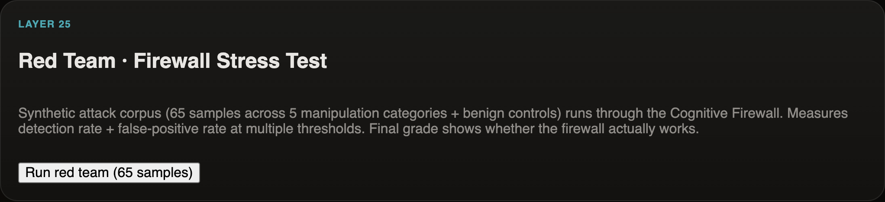            | **Layer 25 — Red Team Simulator.** 65-sample synthetic attack corpus across 5 manipulation categories + benign controls. Outputs detection rate, FPR, F1, and an A–F verdict grade.                                                                     |
| 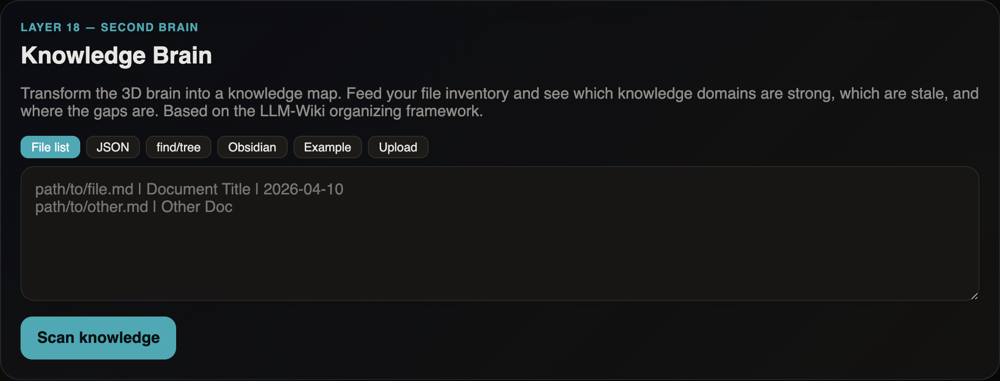     | **Layer 18 — Knowledge Brain.** Second-brain system with file scanner (find/tree, Obsidian import), LLM-Wiki markdown generator, and Gemma-powered gap analysis.                                                                                        |
| 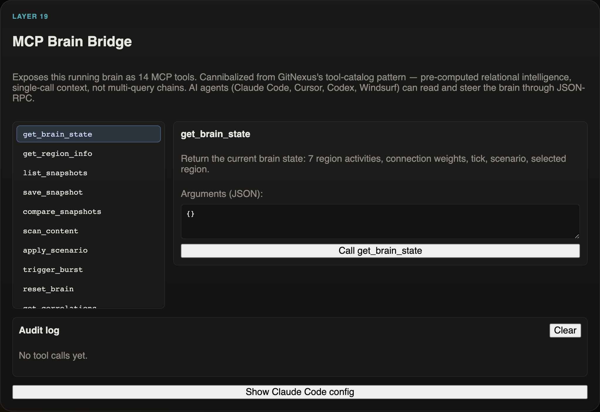          | **Layer 19 — MCP Brain Bridge.** 14 tools exposed via JSON-RPC. Standalone Node stdio server + WebSocket relay so Claude Code / Codex agents can read and steer the brain.                                                                              |
| 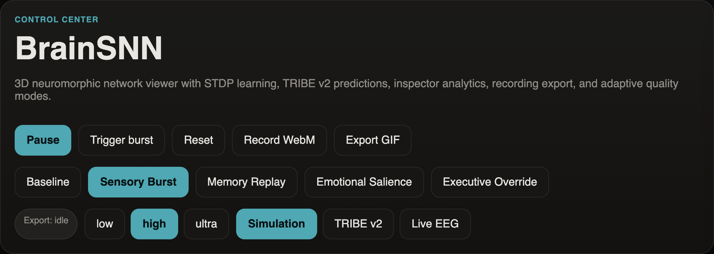           | **Layer 7 — Analytics Dashboard.** Sparkline trends, Pearson correlation matrix across regions, z-score anomaly detection with threshold alerts.                                                                                                        |

## Architecture

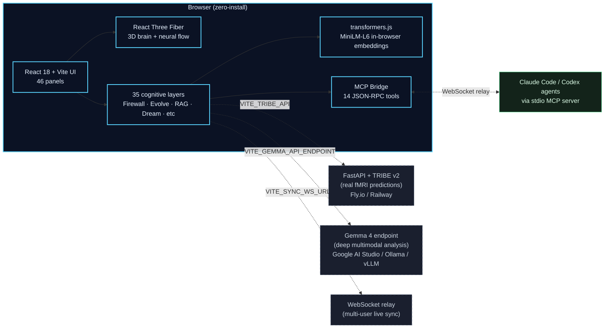

The browser column ships everything in the box. Every external arrow is gated by an env var — leave them blank and the corresponding layer falls back gracefully (TRIBE → STDP simulation, Gemma → regex scoring, sync → solo mode).

## Quickstart

```bash
git clone https://github.com/slavazeph-coder/the-brain
cd the-brain/brainsnn-r3f-app
npm install     # or: npm ci  (uses .npmrc for legacy-peer-deps)
npm run dev     # → http://localhost:5173
```

That's it. The 3D brain renders, the simulation loop ticks, all 35 layers are wired. No keys needed.

## Environment variables

All variables are **optional**. The app runs in pure-frontend mode without any of them set.

| Variable                  | What it unlocks                                               | Where to get it                                                                                                   |
| ------------------------- | ------------------------------------------------------------- | ----------------------------------------------------------------------------------------------------------------- |
| `VITE_TRIBE_API`          | TRIBE v2 fMRI predictions instead of STDP simulation          | Run [brainsnn-r3f-app/server/](brainsnn-r3f-app/server/) locally or deploy to Fly.io                              |
| `VITE_GEMMA_API_ENDPOINT` | Gemma 4 deep multimodal analysis (text, images, video, audio) | [Google AI Studio](https://aistudio.google.com), Ollama, or any OpenAI-compatible endpoint                        |
| `VITE_GEMMA_API_KEY`      | Auth for the Gemma endpoint above                             | Same as above                                                                                                     |
| `VITE_SYNC_WS_URL`        | Multi-user live sync over WebSocket                           | Run any WebSocket relay; example schema in [LiveSyncPanel.jsx](brainsnn-r3f-app/src/components/LiveSyncPanel.jsx) |

See [brainsnn-r3f-app/.env.example](brainsnn-r3f-app/.env.example) for the copyable template.

## Run it locally

The 3D brain is a pure static SPA — no Node runtime, no server, no auth. Build it once, serve `dist/` from anything.

### Dev server (with HMR)

```bash
cd brainsnn-r3f-app
npm install
npm run dev          # → http://localhost:5173
```

### Production preview

```bash
cd brainsnn-r3f-app
npm run build        # → dist/  (~1.4 MB, three.js chunked separately)
npm run preview      # → http://localhost:4173 — same bundle Vercel/Netlify would serve
```

### Serve `dist/` from anything

The build output is just an `index.html` + a few hashed JS / CSS chunks. Drop it behind any static webserver:

```bash
# Built-in Python — zero install
cd brainsnn-r3f-app/dist && python3 -m http.server 8080

# Caddy — auto-HTTPS for a public hostname
caddy file-server --root brainsnn-r3f-app/dist --listen :8080

# Nginx — drop `try_files $uri /index.html;` for SPA routing
#   root /srv/the-brain/brainsnn-r3f-app/dist;

# Tunnel a local server to a public URL on demand
cloudflared tunnel --url http://localhost:4173
# or:  ngrok http 4173
```

> SPA routing note: any host you pick should rewrite unknown paths to `/index.html`. Vite's `npm run preview` already does this; nginx/caddy snippets above show how.

### Optional backend (TRIBE v2)

The Python/FastAPI server is fully optional — without it, the app runs in STDP simulation mode and every panel still works. When you want real fMRI predictions:

```bash
cd brainsnn-r3f-app/server
docker build -t brainsnn-tribe .
docker run -p 8642:8642 --rm brainsnn-tribe

# then in brainsnn-r3f-app/.env:
echo "VITE_TRIBE_API=http://localhost:8642" >> ../.env
```

Cloud-host configs ([Fly.io](brainsnn-r3f-app/server/fly.toml), [Railway](brainsnn-r3f-app/server/railway.toml)) are checked in for later. Full backend docs: [brainsnn-r3f-app/server/README.md](brainsnn-r3f-app/server/README.md).

## Project layout

```
the-brain/
├── brainsnn-r3f-app/         ← the deployable: 35-layer 3D brain viewer
│   ├── src/
│   │   ├── components/        ← 46 React components, one per panel + brain scene
│   │   ├── utils/             ← simulation, embeddings, RAG, evolve, firewall, …
│   │   └── data/network.js    ← 7 regions × 10 pathways topology
│   ├── server/                ← FastAPI + TRIBE v2 (optional backend)
│   │   ├── api.py             ← /health · /scenarios · /predict
│   │   ├── Dockerfile         ← Python 3.11-slim + nilearn pre-warm
│   │   ├── fly.toml           ← Fly.io 4GB VM config
│   │   └── railway.toml       ← Railway alternative
│   ├── mcp-server/            ← Node stdio MCP bridge for Claude Code / Codex
│   └── .env.example           ← all 4 optional env vars documented
├── ui/
│   ├── brainsnn-site/         ← marketing landing page (GitHub Pages)
│   └── brainsnn-viewer/       ← alternate product-style viewer
├── agents/                    ← OpenClaw agent library (177 templates + 9-agent system)
├── xio_evolve/                ← XIO-Evolve Learn→Design→Experiment→Analyze pipeline
├── docs/
│   ├── screenshots/           ← 12 panel shots + demo GIF (used by this README)
│   └── architecture.mmd       ← Mermaid source for the diagram above
└── BRAINSNN_START_HERE.md     ← multi-surface explainer (3 apps in one repo)
```

## Tech stack

- **Frontend:** React 18, Vite 5, React Three Fiber 8, Three.js 0.170, postprocessing 6, FFmpeg.wasm
- **In-browser ML:** transformers.js (`Xenova/all-MiniLM-L6-v2`, ~25MB quantized), pure-JS Louvain community detection, BM25 + trigram Jaccard hybrid search
- **Backend (optional):** FastAPI, Uvicorn, Meta TRIBE v2, nilearn, NumPy
- **Agent integration:** Node stdio MCP server, WebSocket relay, 14 JSON-RPC tools

## Contributing

This repo is the joint workspace of [Claude Code](https://claude.com/claude-code) and [Codex CLI](https://github.com/openai/codex), coordinated through `.ai-memory/`. The architecture and conventions live in [.ai-memory/architecture.md](.ai-memory/architecture.md) and [.ai-memory/conventions.md](.ai-memory/conventions.md).

Issues and PRs welcome. Good first issues:

- A new manipulation category for the Cognitive Firewall + matching red-team corpus entries
- A new affect class for the 12-affect taxonomy with a Russell coordinate
- A new neurotransmitter preset (e.g. ketamine micro-dose, propofol)
- A new pre-computed scenario in [brainsnn-r3f-app/server/scenarios/](brainsnn-r3f-app/server/scenarios/)

## License

MIT — see the per-file headers. Cannibalized work credited inline (`GAIR-NLP/ASI-Evolve` for Brain Evolve, `HKUDS/RAG-Anything` for Multimodal RAG, Meta `facebookresearch/tribev2` for the fMRI backend, `Xenova/transformers.js` for in-browser embeddings).
