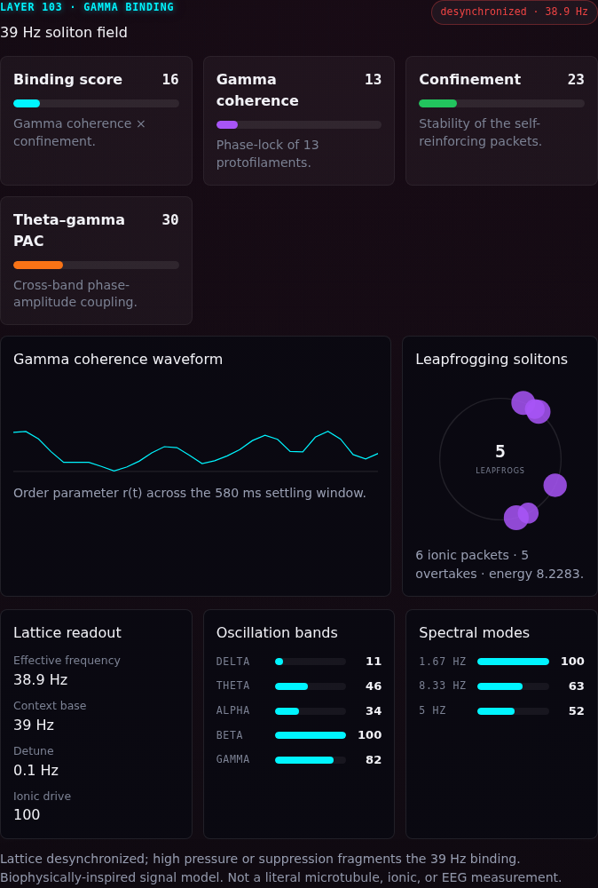
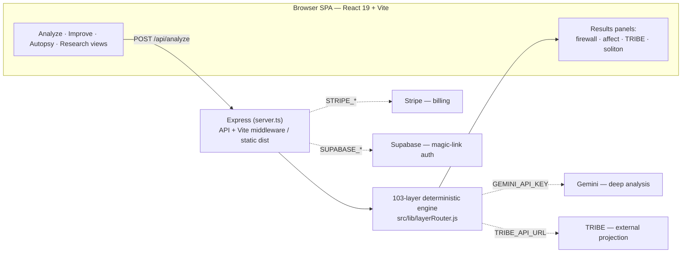
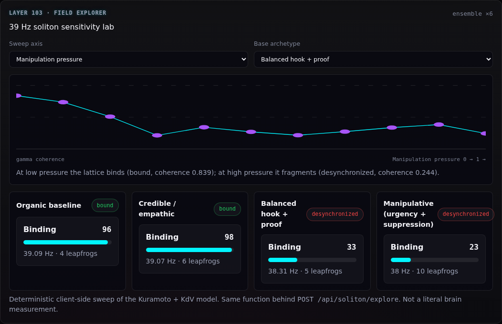

<div align="center">

# The Brain — BrainSNN

**A browser + Express "cognitive brain" that scores any text for attention, trust, manipulation and affect — through a 103-layer deterministic engine, no backprop, no GPU.**

[](#license)
[](https://react.dev)
[](https://vitejs.dev)
[](https://expressjs.com)

<br/>



</div>

---

## What this is

**BrainSNN** is a content-response analyzer dressed as a brain. Paste a headline, ad, email
or script and it estimates hook strength, trust, urgency, emotional charge, manipulation risk
and brand safety — then enriches that base scan through a stack of **103 deterministic
"cognitive" layers**: a Cognitive Firewall, an Affective Decoder, a TRIBE-style 7-region
projection, business-metric mapping, audit receipts, and the newest addition, a **39 Hz
soliton field** (Layer 103).

The whole engine is **deterministic** — identical content yields an identical result — so every
layer is regression-testable and every scan produces a reproducible audit receipt. Results are
AI-estimated content-response signals, **not** literal brain, biometric or EEG measurements.

Optional integrations (Google Gemini for deep analysis, Stripe for billing, Supabase for auth,
an external TRIBE service for fMRI-style projection) each sit behind a single environment
variable. Leave them unset and the app runs fully offline on its deterministic local engine.

## Run it

Everything lives in `brainsnn-r3f-app/` (an Express server that also serves the React SPA):

```bash
cd brainsnn-r3f-app
npm install
npm run dev          # Express + Vite middleware → http://localhost:3000
```

No keys required — the deterministic engine drives every panel out of the box.

```bash
npm test             # node test runner (tinyVitest), 27 tests
npm run lint         # tsc --noEmit
npm run build        # vite build + esbuild → dist/ (client) + dist/server.cjs
npm start            # node dist/server.cjs  (production)
npm run test:e2e     # Playwright end-to-end
```

## Architecture



Every external arrow is gated by an env var; unset, the layer falls back to the deterministic
local path (Gemini → local scoring, Stripe/Supabase → `501 not_configured`, TRIBE → local
7-region projection).

## The engine

A base scan (`src/lib/analysisEngine.js`) is enriched by `runLayerRouter`
(`src/lib/layerRouter.js`), which stacks the core layers onto every result:

| Layer | What it does |
| ----- | ------------ |
| **L4 — Cognitive Firewall** | Deterministic pressure scoring across urgency / outrage / fear / certainty / trust, with matched evidence and named manipulation templates. |
| **L29 — Affective Decoder** | Dominant affect + valence/arousal + threat/reward/social/cognitive clusters. |
| **L3 — TRIBE Projection** | 7-region (CTX/HPC/THL/AMY/BG/PFC/CBL) activation projection; uses an external TRIBE service when configured, else a local mapping. |
| **L48 — Business Metrics** | Maps the scan into 8 decision KPIs (hook strength, trust, manipulation risk, shareability, …). |
| **L46 — Firewall Receipt** | Deterministic content/result/soliton hashes for a reproducible audit trail. |
| **L103 — 39 Hz Soliton Field** | Gamma-band synchrony + leapfrogging ionic-soliton model (below). |

The full catalog of 103 layers lives in `src/lib/layerCatalog.js`; the Research view has a
searchable Layer Explorer.

### Layer 103 — the 39 Hz soliton field

A biophysically-inspired signal layer that models the ~39 Hz gamma oscillation and the
leapfrogging ionic solitons of neuronal microtubules:

- A **Kuramoto ring** of 13 protofilament oscillators near 39 Hz — coherence phase-locks for
  trustworthy content and fragments (desynchronizes) under manipulation pressure.
- A **KdV soliton train** — taller packets travel faster and overtake shorter ones; collisions
  carry the analytic two-soliton phase shift.
- Time-series traces (coherence/frequency waveform), a DFT of the binding envelope, delta→gamma
  oscillation bands with a theta–gamma phase-amplitude coupling metric, and a content-aware base
  frequency. Fully deterministic and seeded from the content hash.

It renders in the results view (`SolitonFieldPanel`) and has an interactive sensitivity lab in
the Research view (`SolitonLabPanel`), backed by `POST /api/soliton`, `GET /api/soliton/presets`
and `POST /api/soliton/explore`. It is a signal-processing analogy, not a microtubule/EEG
measurement.

<div align="center">

</div>

## API endpoints

| Method | Route | Purpose |
| ------ | ----- | ------- |
| GET | `/healthz` | Container health check |
| GET | `/api/layers` | The 103-layer catalog + core layers |
| GET | `/api/engines/status` | Which optional engines are configured |
| POST | `/api/analyze` | Full layer-router scan (Gemini if configured, else local) |
| POST | `/api/rewrite` | Layer-stack rewrite toward a goal |
| POST | `/api/autopsy` | A/B comparison of two variants |
| POST | `/api/soliton` | Layer 103 field for one input (offline) |
| GET | `/api/soliton/presets` | Field for the named archetypes |
| POST | `/api/soliton/explore` | Ensemble-averaged driver sensitivity sweep |
| POST | `/api/auth/magic-link` · `/api/billing/*` | Supabase / Stripe (when configured) |

## Environment variables

All optional — the app runs fully offline without any of them. Set them server-side (not `VITE_`):

| Variable | Unlocks |
| -------- | ------- |
| `GEMINI_API_KEY` | Gemini deep analysis on `/api/analyze` (else deterministic local engine) |
| `STRIPE_SECRET_KEY`, `STRIPE_PRICE_BASIC`, `STRIPE_PRICE_PRO`, `STRIPE_WEBHOOK_SECRET` | Stripe checkout, portal and webhook |
| `SUPABASE_URL`, `SUPABASE_ANON_KEY` | Magic-link auth |
| `TRIBE_API_URL` | External TRIBE projection health/scenarios (else local projection) |
| `PORT`, `APP_URL` | Server port (default 3000) / public URL |

## Project layout

```
the-brain/
├── brainsnn-r3f-app/          ← the deployable app (Express + React SPA)
│   ├── server.ts              ← Express: API endpoints + Vite middleware / static dist
│   ├── src/
│   │   ├── app/               ← shell: AppShell, navigation, landing, sidebar, command palette
│   │   ├── features/          ← scan · results · improve · autopsy · research · memory · pricing · approvals · export
│   │   ├── lib/               ← layerRouter · analysisEngine · solitonLayer · scoreMapping · storage · …
│   │   ├── components/ui/      ← Meter, Badge, Button, …
│   │   ├── styles/            ← tokens.css, utilities.css
│   │   └── test/              ← tinyVitest harness
│   ├── scripts/test-runner.mjs
│   └── tests/                 ← Playwright e2e
├── ui/brainsnn-site/          ← marketing landing site
├── docs/screenshots/          ← UI screenshots
└── README.md
```

## Tech stack

- **Server:** Express 4, TypeScript (run via `tsx`, bundled with `esbuild`)
- **Frontend:** React 19, Vite 6, Tailwind (`@tailwindcss/vite`), `motion`, `lucide-react`
- **Engine:** deterministic 103-layer router — regex/scoring firewall, affect decoder, Kuramoto +
  KdV soliton model, seeded PRNG; no ML runtime required
- **Optional:** `@google/genai` (Gemini), Stripe REST, Supabase Auth, external TRIBE service
- **Tests:** `tinyVitest` (custom node runner) + Playwright

## Contributing

This repo is a joint AI workspace coordinated through `.ai-memory/`. See `AGENTS.md` and
`GOOD_FIRST_ISSUES.md`. Good first issues:

- A new manipulation template + firewall signal (`src/lib/layerRouter.js`)
- A new affect class in the decoder
- A new soliton preset / sweep axis in `src/lib/solitonLayer.js`

## License

MIT — see per-file headers.
