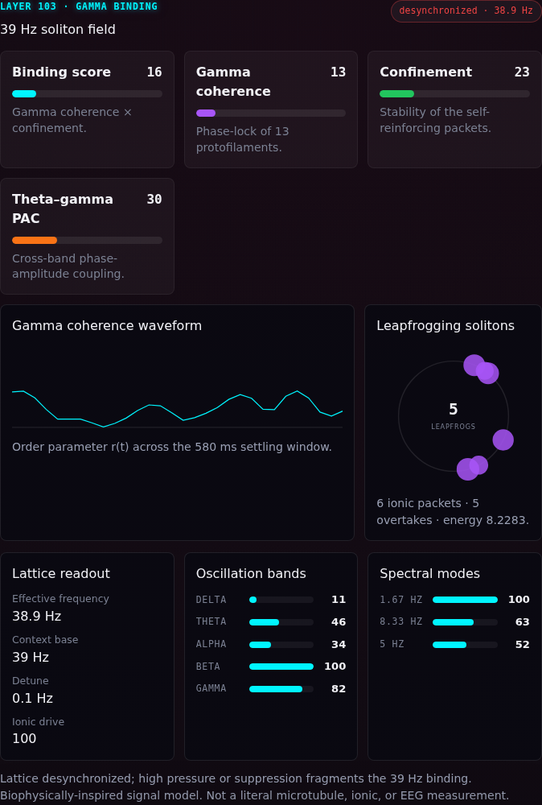
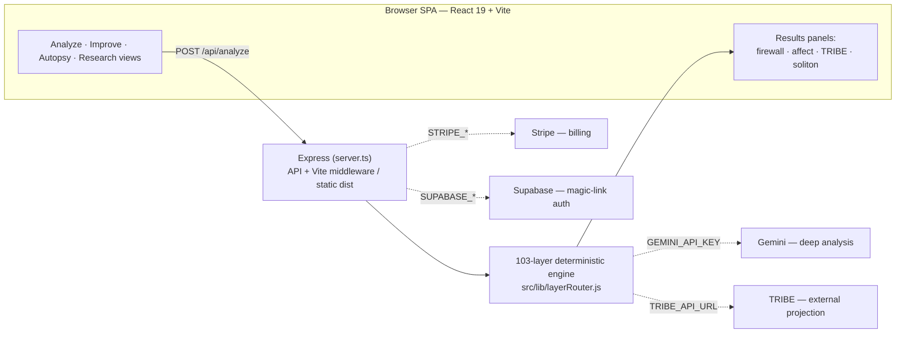
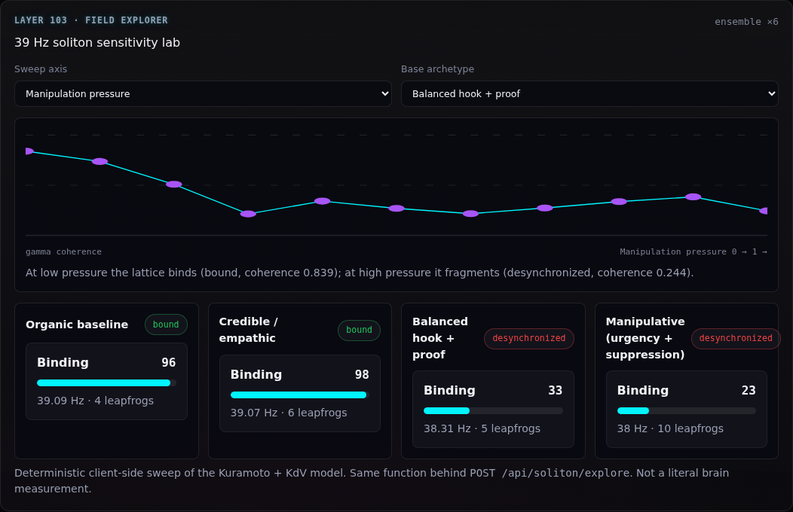

<div align="center">

# The Brain — BrainSNN

**A browser + Express "cognitive brain" that scores any text for attention, trust, manipulation and affect — through a 103-layer deterministic engine (no backprop, no ML runtime), with a live WebGL 3D brain that reacts to every scan.**

[](#license)
[](https://react.dev)
[](https://vitejs.dev)
[](https://expressjs.com)

<br/>



<br/>

**[Score some text](https://www.brainsnn.com/app?utm_source=github&utm_medium=readme&utm_campaign=the-brain)** ·
**[Build a circuit out of falling sand](https://www.brainsnn.com/lab?utm_source=github&utm_medium=readme&utm_campaign=the-brain)** ·
**[What it scores on text it has never seen](https://www.brainsnn.com/evidence?utm_source=github&utm_medium=readme&utm_campaign=the-brain)**

</div>

---

## What this is

**BrainSNN** is a content-response analyzer dressed as a brain. Paste a headline, ad, email
or script and it estimates hook strength, trust, urgency, emotional charge, manipulation risk
and brand safety — then enriches that base scan through a stack of **103 deterministic
"cognitive" layers**: a Cognitive Firewall, an Affective Decoder, a TRIBE-style 7-region
projection, business-metric mapping, audit receipts, and the newest addition, a **39 Hz
soliton field** (Layer 103).

The whole engine is **deterministic** — identical content yields an identical result — so every
layer is regression-testable and every scan produces a reproducible audit receipt. Results are
AI-estimated content-response signals, **not** literal brain, biometric or EEG measurements.

The result lands in a **tabbed results view** (Overview / Line-by-line / Audience / Advanced) next
to a **live WebGL 3D brain** whose regions light up from the scan, and you can export or share a
score card. The scoring itself stays CPU-only and deterministic; the 3D brain is a lazy-loaded
visualization layer.

Optional integrations (Google Gemini for deep analysis, Stripe for billing, Supabase for auth,
an external TRIBE service for fMRI-style projection) each sit behind a single environment
variable. Leave them unset and the app runs fully offline on its deterministic local engine.

## Run it

Everything lives in `brainsnn-r3f-app/` (an Express server that also serves the React SPA):

```bash
cd brainsnn-r3f-app
npm install
npm run dev          # Express + Vite middleware → http://localhost:3000
```

No keys required — the deterministic engine drives every panel out of the box.

```bash
npm test             # node test runner (tinyVitest)
npm run lint         # tsc --noEmit
npm run build        # vite build + esbuild → dist/ (client) + dist/server.cjs
npm start            # node dist/server.cjs  (production)
npm run test:e2e     # Playwright end-to-end
```

**Node 22.6 or newer is required** (enforced by `engines` in `package.json`).
The powder-lab engine is TypeScript and the test runner executes it through
Node's native `--experimental-strip-types` rather than a build step, so the flag
has to exist. On Node 20 `npm test` fails immediately with
`node: bad option: --experimental-strip-types`.

If Playwright refuses to launch because the installed Chromium build number does
not match its own, point it at the binary you have instead of downloading
another one:

```bash
PLAYWRIGHT_CHROMIUM_PATH=/path/to/chromium npm run test:e2e
```

## Architecture


```mermaid
flowchart LR
    subgraph Browser["Browser SPA — React 19 + Vite"]
        views["Analyze · Improve · Autopsy · Research views"]
        panels["Results panels:<br/>firewall · affect · TRIBE · soliton"]
    end

    server["Express (server.ts)<br/>API + Vite middleware / static dist"]
    router["103-layer deterministic engine<br/>src/lib/layerRouter.js"]

    views -->|POST /api/analyze| server
    server --> router
    router --> panels

    router -. GEMINI_API_KEY .-> gemini["Gemini — deep analysis"]
    server -. STRIPE_* .-> stripe["Stripe — billing"]
    server -. SUPABASE_* .-> supabase["Supabase — magic-link auth"]
    router -. TRIBE_API_URL .-> tribe["TRIBE — external projection"]
```

Every external arrow is gated by an env var; unset, the layer falls back to the deterministic
local path (Gemini → local scoring, Stripe/Supabase → `501 not_configured`, TRIBE → local
7-region projection).

## The engine

A base scan (`src/lib/analysisEngine.js`) is enriched by `runLayerRouter`
(`src/lib/layerRouter.js`), which stacks the core layers onto every result:

| Layer | What it does |
| ----- | ------------ |
| **L4 — Cognitive Firewall** | Pressure scoring across urgency / outrage / fear / certainty / trust, with a per-category breakdown, a per-sentence pressure heatmap, an A–F grade, named tactics with confidence, and SemEval-taxonomy persuasion techniques with the phrases that triggered them (`src/lib/firewallLayer.js`, `src/lib/persuasionTechniques.js`, `POST /api/firewall`). |
| **L29 — Affective Decoder** | Dominant affect + valence/arousal, a 9-affect taxonomy on Russell's valence×arousal circumplex, and a per-sentence emotion trajectory (`src/lib/affectLayer.js`, `POST /api/affect`). |
| **L3 — TRIBE Projection** | 7-region (CTX/HPC/THL/AMY/BG/PFC/CBL) activation projection; uses an external TRIBE service when configured, else a local mapping. |
| **L48 — Business Metrics** | Maps the scan into 8 decision KPIs (hook strength, trust, manipulation risk, shareability, …). |
| **L46 — Firewall Receipt** | Deterministic content/result/soliton hashes for a reproducible audit trail. |
| **L103 — 39 Hz Soliton Field** | Gamma-band synchrony + leapfrogging ionic-soliton model (below). |

### How good are the numbers?

The scores used to be asserted. They are now measured against a labelled
corpus of 18 content archetypes (`src/lib/calibrationCorpus.js`), reported as
**rank agreement** rather than invented precision, and guarded in CI so a
scoring change cannot silently regress:

| Dimension | Spearman ρ | Pairs ordered wrongly |
| --- | --- | --- |
| manipulation risk | 0.884 | 8 / 117 |
| trust | 0.700 | 16 / 107 |
| urgency | 0.641 | 14 / 111 |
| viral pull | 0.366 | 32 / 107 |

**84% of 442 labelled comparisons ranked correctly** (mean ρ 0.648). These are
**in-sample** figures — see the holdout section below for what the same code does
on text it has not seen.

Calibration found a real defect: trust was originally **anti-correlated**
(ρ −0.505), scoring outrage bait as more trustworthy than a sincere apology,
because it counted trust *vocabulary* rather than evidence. Adding specificity
and stated-limitation signals — and discounting specifics that sit inside
urgency phrasing, so a fake deadline cannot buy credibility — turned it
positive.

### Naming techniques the way everyone else names them

The firewall's original four tactics — forced urgency, fear pressure, outrage
hook, certainty theater — were ours. Only one of them mapped onto a class
anyone else had annotated, which made them impossible to check against outside
work. `src/lib/persuasionTechniques.js` adds a detector whose classes are taken
from the **SemEval propaganda / persuasion taxonomies** (SemEval-2020 Task 11
"PTC", SemEval-2023 Task 3): Loaded Language, Appeal to Fear/Prejudice,
Name Calling, Exaggeration/Minimisation, Doubt, Bandwagon, Appeal to Authority,
Thought-terminating Cliché, Black-and-White Fallacy, Obfuscation, Appeal to
Time, Repetition — 12 classes named verbatim, plus 2 detections whose mapping is
approximate and **labelled as approximate in the UI and excluded from
`coveredClasses()`**, because claiming verbatim coverage you only partly
approximate is borrowed credibility.

Each detection carries the phrases that triggered it and the sentences they came
from, so it is explainable rather than an opaque score. Eleven of the twelve are
cue-phrase detectors; Repetition is structural, because repetition has no cue
phrase to look for.

### What happened when we actually held data out

The numbers above are **in-sample**. Both the engine score and the detector's
cue lists were shaped while looking at those 18 archetypes, so they measure fit,
not skill. `src/lib/holdoutCorpus.js` is 17 passages written to be scored
**once**, under a rule enforced by comment, test and code review: *no detector
pattern may be tuned in response to a result on this set.*

It went badly, and that is the point of having it:

| | In-sample | Held out |
| --- | --- | --- |
| engine score alone | 0.631 | **0.051** |
| technique detector alone | 0.918 | **0.488** |

The engine score's rank agreement was **almost entirely corpus memorisation** —
0.051 is no better than arbitrary on text it has not seen. The detector
generalises poorly too, but it is the only component that generalises at all.

That inverted the original design. The detector was first folded in at 30%
weight, hedged *toward* the engine score on the theory that a tuned lexicon was
the riskier input. The holdout showed the hedge pointed at the worse
generaliser, so the weight is now **50%**, near the top of a flat held-out range
and free in-sample (0.892 → 0.884). One caveat stated plainly: that weight was
chosen using the holdout, so the weight itself is not independently validated
even though the two measurements behind it are.

Three specific failures, each pinned by a test so they stay visible:

- **0 of 4 paraphrased techniques detected.** "The window shuts Friday and we
  are not reopening it" is Appeal to Time by any annotator's reading and the
  detector sees nothing. This is the recall ceiling `DETECTOR_LIMITS` claims,
  demonstrated rather than asserted.
- **3 false alarms on 5 benign passages** — a security notice that must say
  "suspicious activity", a postmortem that must say "destroyed", an honest pitch
  that says "the best tool we have shipped" and then gives the benchmark. This
  is the failure mode that matters most, because flagging an honest message is
  worse than missing a manipulative one.
- **50% of annotated classes found**, and 67% of manipulative passages flagged
  at all.

So: "no technique matched" is a much weaker claim than "no manipulation", and
the UI says so. The detector is a useful signal and a poor classifier, which is
what a cue-phrase method should be expected to be — published systems for these
classes are fine-tuned transformers. `scripts/eval-corpus.mjs` is where a real
external corpus gets scored when licensing allows one to be vendored.

Two honesty notes, both enforced by tests rather than left to good intentions:

- The scores are **0–100 indices, not probabilities**. Each one is shown with
  its percentile against the corpus, because "86th percentile of known
  archetypes" is a true statement where "86%" is not.
- Labels are **ordinal**. We can defend that phishing carries more pressure
  than an understated luxury line; we cannot defend a claim that it scores
  exactly 84. See `docs/ANNOTATION_RUBRIC.md`, which also requires a
  Krippendorff's alpha (`src/lib/agreement.js`) before any corpus release
  claims reliability.

### Defend the Brain — the detector, as a game you play in 3D

The site had a beautiful 3D brain that did nothing and a real game rendered as a
flat diagram. `BrainScene.jsx` drew seven regions and ten curved axons whose
width tracked live STDP weights — while using **two of the eleven** control verbs
the simulation exposes. Twenty lines away, the game took the same regions and
pathways and threw away the Y axis to project them onto a 2D canvas.

Lab 014 now plays on the actual brain, and **the enemies are the persuasion
techniques found in real text**. Paste an email, or pick a level built from the
labelled archetype corpus; `detectTechniques()` runs; every detection becomes
packets that fly the axons carrying the literal phrase that triggered them.

Each technique attacks where it actually attacks a reader, and each route has a
counter among the five interventions the game already had — so this added no new
player verbs:

| Route | Techniques | How you stop it |
| --- | --- | --- |
| **Threat loop** `THL→CTX→AMY→BG` | fear, ultimatums, manufactured deadlines, prize lures | cut either link, or take the amygdala offline |
| **Familiarity** `THL→CTX→HPC` | bandwagon, authority, repetition | steady the pattern (CBL) |
| **Reasoning** `THL→CTX→PFC` | doubt, obfuscation, thought-terminating clichés | drive judgment (PFC) |

Tap a region to stimulate it, hold to lesion it, tap an axon to cut it. A test
asserts every route is answerable, because a route with no counter would be an
unwinnable attack.

**Packets are derived, not simulated.** Run proofs replay `(seed, [{tick, id}])`
and recompute the score, so frame-rate-dependent packet physics would make every
replay diverge. Packets are scheduled up front from a seeded RNG and everything
touching a score resolves in the logical tick domain: *visuals may interpolate,
scoring never does.* Proofs go to v2 with the packet schedule so containment is
verifiable the same way defense already was — with the triggering phrases
redacted first, because a proof is meant to be shared and those phrases are the
player's own words.

Playtested through the resolver rather than asserted: doing nothing contains 0%,
one counter 36–43%, both guards 57%, all five played early 100% — and all five
played at tick 200 only 43%. Timing is the skill, and that is a test.

The game also states what its own instrument cannot see. A panel next to the
board carries the held-out numbers: half the annotated techniques found, **none**
of the four paraphrased ones, three false alarms on five benign passages. A
detection is a prompt to look, not a verdict.

**Challenge links** (`?lab=braingame&state=<mode>~<level>`) carry the mode, the
level and — for a passage you pasted yourself — its text, so a recipient fights
the same thing rather than the default. Unrecognised input is rejected rather
than guessed at, so a link to a level that no longer exists opens the ladder
instead of something arbitrary. Run proofs are separate and deliberately carry
**no text at all**: only a seed, tick/intervention pairs, and a redacted packet
schedule, because a proof is something you publish and the phrases in it would
be your own words.

### The brain, and a real spiking network

The 7-region model (`src/features/brain3d/brainModel.js`) is deterministic and
seeded, so the same content always produces the same run — which is what makes
brain readouts scoreable, shareable and verifiable. It exposes interventions
(lesion a region, cut a pathway, inject current) and derived measurements:
firing rates in Hz, PFC/AMY control ratio, hijack index, gain around the
THL→CTX→AMY→BG⊣THL control loop, E/I balance, spike correlation, settling
time, plasticity and net STDP flux.

That model is a *rate* model. `src/lib/snn/` adds the real thing: a leaky
integrate-and-fire network in the Brunel (2000) formulation — Dale's law,
sparse random connectivity, transmission delays, Poisson drive — with the
standard measurements (CV of ISI, Fano factor, population spectrum). Its
regime behaviour is checked against the published analysis in
`brunelValidation.test.js`, so **gamma-band power is measured rather than
asserted**.

**Claim boundary.** Every neural readout ships with it: these are simulated
dynamics of a model driven by lexical features of the text, not a measurement
of any human brain, and not a clinical or predictive claim. The simulation is
downstream of the same lexical scores, so it adds structure — not new
information about the text.

The full catalog of 103 layers lives in `src/lib/layerCatalog.js`; the Research view has a
searchable Layer Explorer.

### Neuro Powder Lab — `/lab`

A falling-sand sandbox (`src/features/powder/`) where four of the materials are
the spiking model. A 240×160 cellular automaton runs in one packed
`Uint32Array` at 60 fps on the main thread: sand piles, water levels, oil
floats and burns, acid eats everything except wall, lava turns sand to glass.

Drawn alongside those are **Neuro**, **Synapse**, **Dopamine** and
**Inhibitory neuron**. A neuron cell is a leaky integrate-and-fire unit; a
synapse conducts one cell per tick, so transmission delay is proportional to
wire *length* rather than a fixed constant; a synapse that fires shortly before
its downstream neuron gains weight, and gains it three times faster inside a
dopamine field. Weight renders as brightness, so a circuit visibly learns.

The **neuron model toggle** is the point. "Game feel" uses constants picked so
a hand-drawn circuit is legible at a glance. "Brunel (2000) model" imports the
parameters straight from `src/lib/snn/lifNetwork.js` — the same threshold,
reset, exponential decay and refractory period the validated network uses —
rather than retyping them, so the two cannot drift apart. Post-synaptic
amplitude is the one deliberate exception: it is scaled by a constant the page
states on screen, because Brunel's `J = 0.1 mV` against a 20 mV threshold needs
hundreds of coincident inputs, which a hand-drawn circuit does not have.

**The regime readout is the payoff.** A recorder accumulates spike statistics
in exactly the shape `src/lib/snn/snnMetrics.js` already reads, so a circuit you
drew is measured by the same module — not a second implementation — that
characterises the validated Brunel network on the research page: CV of
inter-spike intervals, population Fano factor, synchrony, and Brunel's
four-way `AI` / `SI` / `SR` / `AR` label.

It is at least as careful about what it *won't* report:

- **No rate in hertz under "game feel."** A game tick is a rendered frame with
  no duration, so hertz would be invented. The dimensionless statistics are
  still shown; the rate reads `—` and the page says why.
- **No regime label under "game feel"** either — the thresholds are calibrated
  against Brunel's analysis, which the game constants are not.
- **No label below 8 neurons.** Four neurons in a ring have a CV of ISI, but
  calling it "asynchronous irregular" would be dressing an anecdote in a result.
- **No label before there are enough intervals** to compute CV at all.

Each of those refusals is a test, because a readout that always prints
something is the easy version to build and the wrong one.

**The page's own lede was the last overclaim.** It ended *"not numbers invented
for a game"* — while the model the page loads with is labelled, three panels
away, *"arbitrary constants chosen to be responsive"*. The published model is
the **structure** (leaky integration, refractory period, pre-before-post
plasticity); the Brunel numbers are one toggle away. The lede now says that, and
a test checks each half: threshold, reset, decay, refractory and inhibition are
imported from `BRUNEL_DEFAULTS` unchanged, the amplitude is the single scaled
parameter and its note names the factor, and the default set is verifiably not
the published one.

**Stamp blurbs are claims too**, and auditing them found three more that were
false. "Learning bench — Stimulate it and watch the weight climb" never
climbed: Stimulate fires both ends on the same tick, so the synapse never spikes
before the far neuron. The "Feedback loop" had blank corners, leaving four
dead-end stubs rather than a ring. And "one neuron drives another" was not what
happened with a fresh wire — Stimulate fired both ends directly, so the far
neuron would have fired with no wire at all. All three are fixed and pinned,
including the negative cases.

Fixing them surfaced the model's actual shape, which is now stated rather than
implied: one learned arrival is 12 mV against a 20 mV threshold, so a **single**
spike charges a resting neuron but does not fire it. Two do — either two sparks
in quick succession, or two equal-length arms arriving on the same tick. That
last one makes the feedback loop a coincidence detector under the Brunel model:
cut one arm and it goes quiet. Under the game constants a single arrival already
clears threshold, so the blurb scopes the claim to the model it holds for.

**Every palette tooltip is a claim, and each one is tested.** `promises.test.ts`
walks the material table and asserts the specific thing each blurb says — fire
consumes plants, gas ignites, dopamine flows, water levels, a synapse conducts
exactly one cell per tick. Writing it found that oil did not burn: because fire
is the lightest thing on the grid, anything denser sank straight past it, so a
flame lit on a pool was pushed up out of the fuel within a tick or two. An
84-cell pool lost **one** cell in 250 ticks, which is not what "extremely
flammable" describes. Fire is now anchored while it burns — it still rises only
once it has nothing left to eat, and still burns out — and the same pool goes
to zero in about 120 ticks.

**Spark is an electrode, not a paintbrush.** Building the objectives surfaced a
real gap: the only way to inject charge was a global *Stimulate all*, which
fires every neuron on the same tick. Two wired neurons therefore always fired
simultaneously, their spikes travelled toward each other and annihilated
mid-wire, and the synapse next to a neuron never spiked *before* it. STDP is
pre-before-post, so **no circuit could ever learn**. Spark charges the one
neuron you click. Measured against a 9-cell wire: sparking the downstream
neuron 4 or 8 ticks later leaves the weight at 0.1, and 9 to 16 ticks later
drives it to 1.0 — which is the causal window, discoverable by playing.

**Objectives close the loop.** Six of them, ordered so following them teaches
the model rather than the interface: make something fire, run a spike down a
long wire, teach a synapse past weight 0.8, learn faster with dopamine, push a
neuron below zero with inhibition, and reach the asynchronous irregular regime.

Every one is verified from engine state — a flood fill over connected synapse
cells, a weight, a negative membrane potential, the measured regime — so an
objective can only be completed by building the thing. None can be awarded for
pressing a button or visiting a panel, and a test asserts that all six are
false on an empty grid. They also do not start counting until you draw, stamp
or stimulate: the opening scene fires by itself, and being credited for
watching a demo is the kind of hollow progress this is meant not to be.

Every route serves its own social card. The app is a SPA, so all four routes
used to return the same `index.html` and therefore the same `<title>` and Open
Graph tags — a shared `/lab?grid=…` link previewed identically to the homepage,
which matters when sharing is the growth loop. `src/lib/routeMeta.js` rewrites
the tags server-side (scrapers do not run JavaScript), and a link carrying a
grid says so rather than inheriting the lab's generic card.

**A shared circuit previews as itself.** The card for a `?grid=…` link is drawn
from the link: `GET /api/og/lab` decodes the grid, loads it into a real engine
and renders it with the same function the browser canvas uses, so the preview
cannot drift from what opening the link shows. The PNG is written by
`src/lib/png.js` on top of Node's `zlib` — a signature, three chunks and a CRC
each — rather than by adding an image dependency to a server whose point is that
it needs none.

Sharing is a hand-rolled run-length encoding in the URL (`?grid=…`), not a
dependency and not a server: a grid is mostly long runs of the same material,
so a full 240×160 scene fits in a few hundred characters. Nothing is uploaded.

**A crawler sees a page rather than an empty div.** The served document is
`<div id="root"></div>` and a module script, so anything that does not execute
JavaScript — which is most assistant crawlers — saw a blank page on every URL.
Each route now carries its own heading and prose in `routeMeta.js`, injected
into `#root`, where React's `createRoot` replaces it on mount: visitors get the
app, crawlers get content, and the two cannot disagree because there is one
source for both. `/sitemap.xml` is built from the same route table, so it cannot
list a route that 404s or omit one that just launched.

**Where visitors come from is measured.** Roughly 65 event names all described
what someone did *after* arriving, and nothing described the arrival, so no
traffic experiment could be checked. `src/lib/attribution.js` captures
first-touch source — referrer **host only**, never the path or the search query
that produced it — and every event carries it. Shared lab links tag themselves
`s=lab`, which is what makes the growth loop distinguishable from no loop.

**Performance, measured rather than asserted.** The whole pipeline — automaton
tick, brain layer, pixel render — costs **2.0 ms per frame at 2,200 particles**
and **3.9 ms with all 38,400 cells active**, i.e. 12% and 23% of a 16.7 ms
frame on Node 22. Cost tracks grid size, not particle count, because the scan
visits every cell either way. `perf.test.ts` keeps loose ceilings around those
numbers — loose enough not to flake on a busy runner, tight enough to catch a
rule that goes accidentally quadratic.

**Claim boundary**, shipped on the page: a 2D cellular automaton whose neuron
cells follow a published integrate-and-fire model. It is not a simulation of
cortical tissue and carries no claim about biological brains.

### Layer 103 — the 39 Hz soliton field

A biophysically-inspired signal layer that models the ~39 Hz gamma oscillation and the
leapfrogging ionic solitons of neuronal microtubules:

- A **Kuramoto ring** of 13 protofilament oscillators near 39 Hz — coherence phase-locks for
  trustworthy content and fragments (desynchronizes) under manipulation pressure.
- A **KdV soliton train** — taller packets travel faster and overtake shorter ones; collisions
  carry the analytic two-soliton phase shift.
- Time-series traces (coherence/frequency waveform), a DFT of the binding envelope, delta→gamma
  oscillation bands with a theta–gamma phase-amplitude coupling metric, and a content-aware base
  frequency. Fully deterministic and seeded from the content hash.

It renders in the results view (`SolitonFieldPanel`) and has an interactive sensitivity lab in
the Research view (`SolitonLabPanel`), backed by `POST /api/soliton`, `GET /api/soliton/presets`
and `POST /api/soliton/explore`. It is a signal-processing analogy, not a microtubule/EEG
measurement.

<div align="center">

</div>

## API endpoints

| Method | Route | Purpose |
| ------ | ----- | ------- |
| GET | `/healthz` | Container health check |
| GET | `/api/layers` | The 103-layer catalog + core layers |
| GET | `/api/engines/status` | Which optional engines are configured |
| POST | `/api/analyze` | Full layer-router scan (Gemini if configured, else local) |
| POST | `/api/firewall` | Cognitive Firewall profile for one input (offline) |
| POST | `/api/affect` | Affective Decoder profile for one input (offline) |
| POST | `/api/neural/analyze` | Analyze an authorized decoded-transcript envelope (L19 gateway) |
| POST | `/api/neural/decode` | Proxy an external decoder via `NEURAL_DECODER_URL`, then analyze |
| GET | `/api/neural/capabilities` | Neural gateway modes / modalities / remote status |
| POST | `/api/rewrite` | Layer-stack rewrite toward a goal |
| POST | `/api/autopsy` | A/B comparison of two variants |
| POST | `/api/soliton` | Layer 103 field for one input (offline) |
| GET | `/api/soliton/presets` | Field for the named archetypes |
| POST | `/api/soliton/explore` | Ensemble-averaged driver sensitivity sweep |
| POST | `/api/auth/magic-link` · `/api/billing/*` | Supabase / Stripe (when configured) |

## MCP server (agent bridge)

`brainsnn-r3f-app/mcp-server/` is a stdio [MCP](https://modelcontextprotocol.io) server that
exposes the deterministic engine to agents (Claude Code / Codex) — all tools run offline, no
keys. Tools: `brain_analyze`, `brain_firewall`, `brain_affect`, `brain_soliton`,
`brain_soliton_explore`, `brain_layers`, `brain_decode`.

```bash
cd brainsnn-r3f-app/mcp-server
npm install
npm run smoke        # spawns the server, lists tools, calls a few
```

Register it with an MCP client (e.g. Claude Code):

```json
{
  "mcpServers": {
    "brainsnn": { "command": "node", "args": ["brainsnn-r3f-app/mcp-server/index.mjs"] }
  }
}
```

## Environment variables

All optional — the app runs fully offline without any of them. Set them server-side (not `VITE_`):

| Variable | Unlocks |
| -------- | ------- |
| `GEMINI_API_KEY` | Gemini deep analysis on `/api/analyze` (else deterministic local engine) |
| `STRIPE_SECRET_KEY`, `STRIPE_PRICE_BASIC`, `STRIPE_PRICE_PRO`, `STRIPE_WEBHOOK_SECRET` | Stripe checkout, portal and webhook |
| `SUPABASE_URL`, `SUPABASE_ANON_KEY` | Magic-link auth |
| `TRIBE_API_URL` | External TRIBE projection health/scenarios (else local projection) |
| `NEURAL_DECODER_URL`, `NEURAL_DECODER_KEY` | Approved external communication-decoder endpoint for `/api/neural/decode` (analyzes decoded text only; else replay mode) |
| `LEADS_WEBHOOK_URL`, `LEADS_WEBHOOK_TOKEN` | Where `POST /api/leads` delivers a pilot brief. Unset, the endpoint returns `501` and the form shows its email fallback — it never reports a lead it did not capture |
| `LEADS_FALLBACK_EMAIL` | Address offered when a lead cannot be delivered (default `hello@brainsnn.com`) |
| `VITE_ANALYTICS_URL` | Collector that receives `track()` events as JSON. Unset, nothing is sent |
| `PORT`, `APP_URL` | Server port (default 3000) / public URL |

## Project layout

```
the-brain/
├── brainsnn-r3f-app/          ← the deployable app (Express + React SPA)
│   ├── server.ts              ← Express: API endpoints + Vite middleware / static dist
│   ├── src/
│   │   ├── app/               ← shell: AppShell, navigation, landing, Reconstruct page, command palette
│   │   ├── features/          ← scan · results (tabbed) · improve · autopsy · research · brain3d · powder · social · export · …
│   │   │   └── powder/        ← Neuro Powder Lab: cellular automaton + LIF layer (TypeScript, unit-tested)
│   │   ├── lib/               ← layerRouter · analysisEngine · solitonLayer · scoreMapping · storage · …
│   │   ├── components/ui/      ← Meter, Badge, Button, …
│   │   ├── styles/            ← tokens.css, utilities.css
│   │   └── test/              ← tinyVitest harness
│   ├── scripts/test-runner.mjs
│   └── tests/                 ← Playwright e2e
├── ui/brainsnn-site/          ← marketing landing site
├── docs/screenshots/          ← UI screenshots
└── README.md
```

## Tech stack

- **Server:** Express 4, TypeScript (run via `tsx`, bundled with `esbuild`)
- **Frontend:** React 19, Vite 6, Tailwind (`@tailwindcss/vite`), `motion`, `lucide-react`
- **3D brain:** a live WebGL brain (`three`, `@react-three/fiber`, `@react-three/drei`) that reacts
  to each scan. It is **lazy-loaded** — `src/features/brain3d/Brain3D.jsx` is the only module that
  imports `three`/R3F, so it stays out of the main bundle and degrades to a 2D canvas fallback.
- **Engine:** deterministic 103-layer router — regex/scoring firewall, affect decoder, Kuramoto +
  KdV soliton model, seeded PRNG; the scoring engine itself needs **no ML runtime and no GPU**.
- **Results UI:** tabbed — Overview / Line-by-line / Audience / Advanced — plus shareable score
  cards (`src/features/social`, `src/features/export`) and a classics gallery.
- **Optional:** `@google/genai` (Gemini), Stripe REST, Supabase Auth, external TRIBE service, and an
  external communication decoder via `NEURAL_DECODER_URL`.
- **Tests:** `tinyVitest` (custom node runner) + Playwright; CI runs typecheck + tests + build + the
  MCP smoke on every PR (`.github/workflows/ci.yml`).

## Contributing

This repo is a joint AI workspace coordinated through `.ai-memory/`. See `AGENTS.md` and
`GOOD_FIRST_ISSUES.md`. Good first issues:

- A new manipulation template + firewall signal (`src/lib/layerRouter.js`)
- A new affect class in the decoder
- A new soliton preset / sweep axis in `src/lib/solitonLayer.js`

## License

MIT — see per-file headers.
