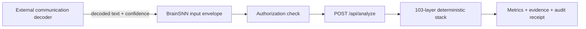

# Decoder Transcript Gateway

## Purpose

The gateway gives BrainSNN a practical integration boundary for communication-decoder research without claiming that BrainSNN itself reads neural activity.

A decoder produces text and confidence metadata. BrainSNN normalizes that output, preserves provenance, and sends the transcript through the existing deterministic analysis stack.

## What ships in this release

- A versioned `brainsnn.neural-input.v1` envelope.
- Confidence normalization from either `0..1` probabilities or `0..100` percentages.
- Source, decoder, model-version and session provenance.
- Optional per-token confidence values.
- Capture metadata for reproducible research records.
- Explicit authorization confirmation and a `rawSignalRetained: false` policy.
- A Research workspace importer that submits the decoded transcript to `/api/analyze`.
- Regression tests for normalization, sanitization, provenance and no-retention behavior.

## Data flow



The integration starts after decoding. Source recordings are not uploaded or stored by this release.

## Envelope example

```json
{
  "schemaVersion": "brainsnn.neural-input.v1",
  "mode": "replay",
  "modality": "decoded_text",
  "decodedText": "Customer proof makes this launch easier to trust.",
  "confidence": 0.78,
  "provenance": {
    "source": "research-import",
    "decoder": "Research decoder",
    "modelVersion": "2.0",
    "sessionId": "session-42"
  },
  "research": {
    "consentConfirmed": true,
    "rawSignalRetained": false
  }
}
```

## Relationship to Meta Brain2Qwerty

Meta's Brain2Qwerty work demonstrates that a specialized external model can convert non-invasive recordings collected during typing into language predictions. BrainSNN should not duplicate that acquisition and decoding stack. Its useful role is downstream: accept authorized decoder output, keep confidence and provenance visible, analyze communication effects, compare variants, and produce deterministic receipts.

Official research overview:

- https://ai.meta.com/blog/brain2qwerty-brain-ai-human-communication/
- https://ai.meta.com/research/publications/brain2qwerty/

## Product boundary

This feature:

- analyzes decoded text;
- does not claim direct thought reading;
- is not a diagnostic or clinical tool;
- does not infer identity or medical state;
- does not retain source recordings;
- keeps experimental functionality inside the Research workspace.

## Next milestones

1. Add a server-side adapter that accepts the same decoded-text envelope from approved external services.
2. Add token-confidence visualization and uncertainty-aware result labels.
3. Add benchmark fixtures using published or properly licensed decoder outputs.
4. Compare deterministic BrainSNN results across original, decoded and corrected transcripts.
5. Add signed receipts and configurable retention policies before any production pilot.
